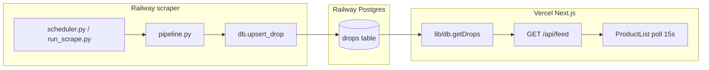

# DropAlert data flow

End-to-end path from scrape to UI (no page refresh after load).



## 1. Scraper → database

| Step | File | What happens |
|------|------|----------------|
| Schedule | `scraper/scheduler.py` | Runs `run_scrape_sync()` every 30 min (+ once on start) |
| Pipeline | `scraper/pipeline.py` | Scrapes 9 brands → `filter_shoe_drops()` |
| Write | `scraper/db.py` → `upsert_drop()` | `INSERT` or `UPDATE` on `drops`; sets `scraped_at = NOW()` |
| Commit | `upsert_drop()` | `conn.commit()` after each write |
| Alert filter | `scraper/alerts/style_match.py` | If subscriber has `style_description`, Claude YES/NO before email |

**Env:** `DATABASE_URL` on the **Railway scraper service** (reference Postgres plugin).

**Table:** `drops` columns used by the app:  
`id, brand, name, drop_date, price, image_url, product_url, product_id, scraped_at`

## 2. API → database (no cache)

| Step | File | What happens |
|------|------|----------------|
| Route | `frontend/app/api/feed/route.ts` | `dynamic = "force-dynamic"`, `revalidate = 0` |
| Query | `frontend/lib/db.ts` → `getDrops()` / `getStats()` | Live `pg` pool query: `ORDER BY scraped_at DESC` |
| Response | `/api/feed` | JSON `{ drops, stats, updatedAt }` + `Cache-Control: no-store` |

**Env:** same `DATABASE_URL` on **Vercel** as Railway Postgres.

## 3. Frontend → API (15s poll)

| Step | File | What happens |
|------|------|----------------|
| SSR first paint | `frontend/app/page.tsx` | `getDrops()` / `getStats()` → `LiveFeed` initial props |
| Client poll | `frontend/components/ProductList.tsx` | `useEffect` + `setInterval(15_000)` |
| Fetch | `frontend/lib/feedApi.ts` → `fetchFeed()` | `GET /api/feed?_=timestamp`, `cache: "no-store"`, `next: { revalidate: 0 }` |
| UI update | `ProductList` | `setDrops()` from API; `LiveFeed` updates stats via `onFeedUpdate` |

Polling pauses when the browser tab is hidden; refetches when visible again.

## Connection checklist

- [ ] Railway scraper has `DATABASE_URL`, `REDIS_URL`, Resend vars
- [ ] Vercel has `DATABASE_URL` (same Postgres as scraper)
- [ ] Scraper start command: `python scheduler.py`
- [ ] Logs show `Drop write OK` and `Pipeline complete`
- [ ] `curl https://YOUR-APP.vercel.app/api/feed` returns fresh `drops` after a scrape
- [ ] Homepage shows “Live · refreshes every 15s” and stats/drops update without reload

## Manual verification

```bash
# After a scrape run:
curl -s "https://dropalert-sigma.vercel.app/api/feed" | head -c 500

# Local:
cd scraper && python run_scrape.py
cd frontend && npm run dev
# Open http://localhost:3000 — feed should update within 15s of DB changes
```
